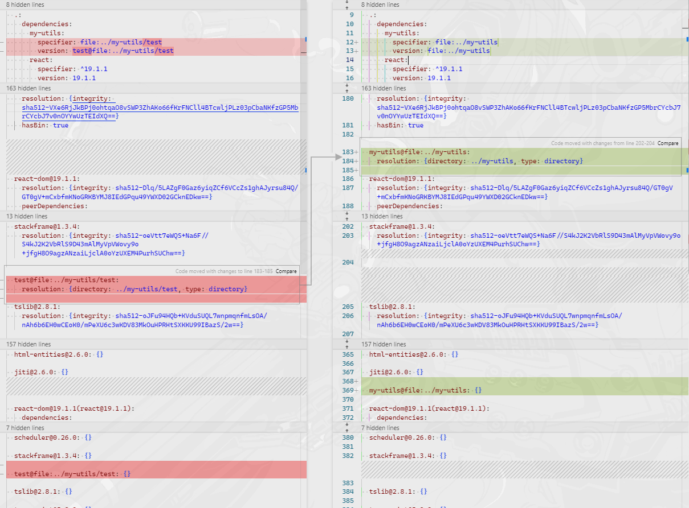
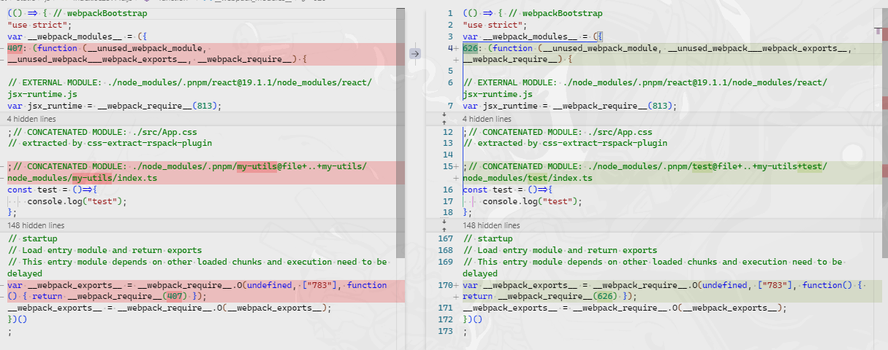
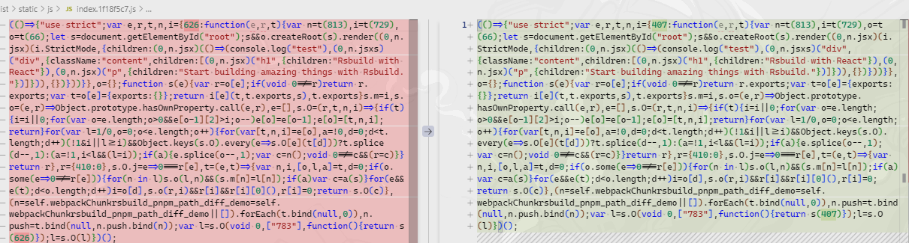

# Rsbuild + pnpm 路径对打包产物影响测试 demo

1、2 两个目录的创建过程为：
1. 使用 `pnpm create rsbuild@latest` 命令创建项目；
2. 在创建的项目中执行 `pnpm install` 创建 pnpm-lock.yaml 文件；
3. 复制该项目，一个命名为`1`，另一个命名为`2`；
4. 在 `1/package.json` 中添加 `my-utils` 依赖，并指定为 `file:../my-utils`；
5. 创建 `my-utils` 目录，并创建 `index.ts` 文件；
6. 然后在`1`目录中执行 `pnpm install` 安装依赖；
7. 在 `2/package.json` 中添加 `my-utils` 依赖，并指定为 `file:../my-utils/test`；
8. 创建 `my-utils/test` 目录，并将原 `my-utils/index.ts` 文件剪切为 `my-utils/test/index.ts` 文件；
9. 然后在`2`目录中执行 `pnpm install` 安装依赖；

## 差异比对

1、2 两个目录的 pnpm-lock.yaml 文件差异如下：

未压缩的打包产物差异如下：

压缩后的打包产物差异如下：

